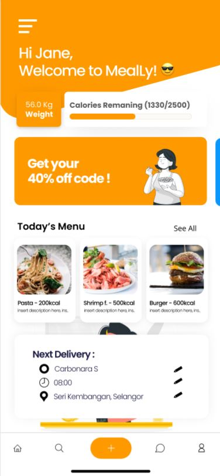

MealLy is my Final Year Project Mobile Application. Its a personalized meal planning and ordering mobile application 

Meally can generate an instant meal plan based on the customer’s Total Daily Energy Expenditure and can reduce inefficient time by its subscription system that can order Whole-day / whole-week meal plan at one-time order 

Mealy meals plan is based on customer’s TDEE this system offers the simplification of diet planning and ordering process for the customer with its subscription service, accordingly to their suitably designed meal plans. 

This Project is a Flutter based project, so that the output can be used on both Android and iOs Platform. and will be using Firestore database which an NoSQL database management system.

This will be my first flutter project and using NoSQL Database as well as firestore database. 

below are the Designing phase of MealLy

